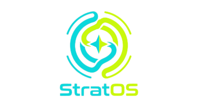

  

  <strong>Turn agent mistakes into controlled strategy improvement.</strong>

  
  
  
  

  <a href="docs/architecture.md">Architecture</a>
  ·
  <a href="docs/integration.md">Integration</a>
  ·
  <a href="apps/finance">Finance Reference</a>
  ·
  <a href="stu-packs">STU Packs</a>
  ·
  <a href="benchmarks">Benchmarks</a>

  <strong>StratOS</strong> is a <em>strategy runtime for agents</em>.

  Most agent frameworks help agents use <strong>tools</strong>, follow <strong>workflows</strong>, and manage <strong>memory</strong>.
  StratOS is built for the missing layer:

<blockquote>
  
<strong>Strategy — how an agent makes decisions, learns from mistakes, and improves without losing control.</strong>

</blockquote>

  It does not replace your agent framework.
  It adds <strong>review, evaluation, and controlled strategy rollout</strong>.

<h2>Why StratOS exists</h2>

  Today, agents can act.
  But when they fail, improvement is still mostly manual:

<ul>
  <li>rewrite the prompt</li>
  <li>add another rule</li>
  <li>patch the workflow</li>
  <li>hope the behavior got better</li>
</ul>

  That is not a real improvement system.

  As agents become persistent, multi-step, and high-stakes, they need something stronger:

<blockquote>
  

    a runtime that can <strong>observe failure, review outcomes, extract recurring patterns, and apply corrections safely</strong>.
  

</blockquote>

  StratOS exists to make that loop a first-class part of the system.

<h2>What StratOS makes possible</h2>

  StratOS turns strategy improvement into runtime infrastructure:

  <strong>Action → Artifact → Claim → Outcome → Review → Error Pattern → Strategy Update → Next Action</strong>

  It helps agents:

<ul>
  <li>generate structured decisions instead of disposable outputs</li>
  <li>track which claims should be reviewed later</li>
  <li>learn from recurring failure patterns instead of isolated logs</li>
  <li>convert lessons into reusable strategy units</li>
  <li>test changes before rollout</li>
  <li>improve behavior without uncontrolled drift</li>
</ul>

<h2>Core idea</h2>

  Most frameworks focus on <strong>capability</strong>.
  StratOS focuses on <strong>judgment</strong>.

<table>
  <tr>
    <td valign="top"><strong>Skills</strong></td>
    <td valign="top">What an agent can do</td>
  </tr>
  <tr>
    <td valign="top"><strong>Memory</strong></td>
    <td valign="top">What an agent can retain</td>
  </tr>
  <tr>
    <td valign="top"><strong>Strategy</strong></td>
    <td valign="top">How an agent decides, gets reviewed, and improves over time</td>
  </tr>
</table>

  StratOS is not another tool layer.
  It is a <strong>review-driven strategy layer</strong> for intelligent systems.

<h2>Core primitives</h2>

<ul>
  <li>
    <strong>Strategy Artifact</strong> 
    Structured decision output that can be tracked, reviewed, and replayed
  </li>
  <li>
    <strong>Strategy Claim</strong> 
    Reviewable assertions extracted from agent output
  </li>
  <li>
    <strong>Outcome Review</strong> 
    A formal way to compare what the agent said with what actually happened
  </li>
  <li>
    <strong>Error Pattern</strong> 
    Recurring mistakes that can be named, grouped, and corrected
  </li>
  <li>
    <strong>Self-Training Units (STU)</strong> 
    Versioned strategy units derived from failures, reviews, and behavioral patterns
  </li>
  <li>
    <strong>Strategy Compiler</strong> 
    Compiles strategy into Prompt Layer, Rule Layer, and Routing Layer
  </li>
  <li>
    <strong>Evaluation & Experiment System</strong> 
    Tests strategy changes before production rollout
  </li>
  <li>
    <strong>Bias Monitoring</strong> 
    Distinguishes real improvement from drift
  </li>
</ul>

<h2>How it fits</h2>

<pre><code>Application Layer
 ├─ Finance Assistant
 ├─ Content Agent
 ├─ Ads Optimization
 ├─ Sales Agent
 └─ Ops Automation

StratOS Core
 ├─ Artifact / Claim Pipeline
 ├─ Review Engine
 ├─ Error Utilization
 ├─ STU Registry
 ├─ Strategy Compiler
 ├─ Rule Engine
 ├─ Evaluation
 ├─ Experiment
 ├─ Bias Monitor
 └─ Routing

Agent Layer
 ├─ LLM
 ├─ Skills / Tools
 └─ Memory

Infrastructure
 ├─ Model Gateway
 ├─ Storage
 ├─ Queue
 └─ Config
</code></pre>

  StratOS does not replace your orchestration layer.
  It gives your system a <strong>strategy runtime for review, controlled improvement, and safe evolution</strong>.

<h2>What makes StratOS different</h2>

<ul>
  <li><strong>Not just memory</strong> — past mistakes become structured strategy assets</li>
  <li><strong>Not just prompt tuning</strong> — improvements are versioned, evaluated, and governed</li>
  <li><strong>Not just adaptation</strong> — changes can be reviewed, tested, rolled out, and rolled back</li>
  <li><strong>Not just agent execution</strong> — strategy quality becomes part of the runtime itself</li>
</ul>

<h2>First proving ground: Finance</h2>

  The first implementation of StratOS is a finance reasoning system with:

<ul>
  <li>portfolio tracking</li>
  <li>prediction generation</li>
  <li>timed review</li>
  <li>error extraction</li>
  <li>strategy evolution</li>
  <li>bias monitoring</li>
</ul>

  Finance is the first reference implementation — not the limit of the framework.

<h2>Open source philosophy</h2>

<blockquote>
  
<strong>Private-instance evolution, open structural collaboration</strong>

</blockquote>

<ul>
  <li>run your own instance</li>
  <li>keep your own data and API keys</li>
  <li>share schemas, rules, STUs, and benchmarks with the community</li>
</ul>

  StratOS is designed so that strategic structure can be shared
  without centralizing private operational data.

<h2>Repository structure</h2>

<ul>
  <li><code>apps/</code> — domain implementations</li>
  <li><code>packages/</code> — StratOS core</li>
  <li><code>stu-packs/</code> — reusable strategy assets</li>
  <li><code>benchmarks/</code> — evaluation datasets</li>
</ul>

<h2>Guiding principle</h2>

<blockquote>
  

    Agents should not only act. 
    They should improve how they decide.
  

</blockquote>
